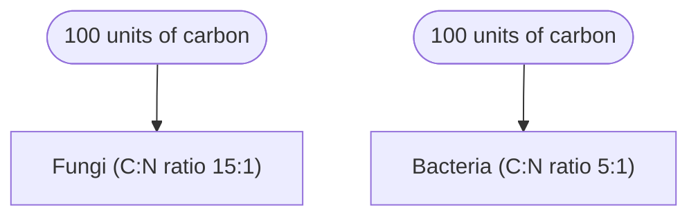

# Soil N Dynamics

## Soil N Pools

| Form           | %       |
| -------------- | ------- |
| Organic        | 90 - 95 |
| Mineral        | 0.1 - 1 |
| Fixed Ammonium | 5 - 10  |

# Sources of N input to Soil
## Biological N Fixation
+ Microbes use Nitrogenase enzyme to convert atmospheric N gas to organically-combined amide groups
$$
\ce{N2 + 8H+ + 6e- ->[Nitrogenase][Fe,Mo] 2NH3 + H2}
$$
+ **Nitrogenase complex**:
	+ Made up of two proteins:
		1. Large protein converts atmospheric $N_2$ to $NH_3$ using electrons provided by the smaller protein.
		2. A small protein that provides electrons (via $FeS$  clusters)
	+ In the large protein:
		+ M-site ($MoFeS$ clusters) uptake $N_2$ from atmosphere
		+ P-site ($FeS$ clusters) use electrons provided from small proteins to reduce $N_2$ to $NH_3$ and produce $H_2$
		+ Breaking $\ce{N#N}$ requires a lot of energy
		+ Nitrogenase is destroyed by free $O_2$, N-fixing organisms have to protect it from exposure to oxygen

## Factors affecting biological N fixation
+ Energy Availability
+ Nutrient Availability
	+ $\ce{Mg}$ for MgATP
	+ S, Mo, Co, V, and Fe are needed for enzymes and cofactors
	+ High $\ce{NO3^-, NH4^+}$ concentrations reduce N fixation
+ Climate, soil (pH, moisture, temperature, light intensity)
	+ Direct effect on $N_2$ fixing microorganisms
	+ Indirect effect on rate of photosynthesis

## Biological N fixation effects on ecosystem
+ Increases N availability to host plant and non-legumes
+ **Lowers pH**
+ In N limited ecosystems:
	+ Increased N availability -> increased NPP -> increased litter fall

## Global N Use

| Fertilizer                               | Chemical Formula | N Content | $\ce{Mt N yr^{-1}}$ |
| ---------------------------------------- | ---------------- | --------- | ------------------- |
| Urea                                     | $\ce{(NH2)2CO}$  | 46%       | 34.4                |
| Ammonium Nitrate                         | $\ce{NH4NO3}$    | 27.5-33%  | 7.5                 |
| Anhydrous                                | $\ce{NH3}$       | 82%       | 4.6                 |
| N solutions                              |                  | varies    | 4.0                 |
| Calcium Ammonium Nitrate                 | $\ce{CaNH4NO3}$  | 27%       | 3.6                 |
| Ammonium Sulfate                         | $\ce{(NH4)2SO4}$ | 21%       | 2.4                 |
| Other N fertilizers                      |                  | varies    | 10.1                |
| Compound N fertilizers (NPK, etc)        |                  | varies    | 11.9                |
| ~={red}**Total mineral fertiliers**=~    |                  |           | ~={red}**78.5**=~   |
| ~={green}**Total Organic Fertilizers**=~ |                  |           | ~={green}**33.0**=~ |
| **Total Fertilizers**                    |                  |           | **111.6**           |

## Facts & Numbers about N fertilizers (USA)

+ **Amount**:      11.4 $\ce{}$

## Urea: The first organic molecule synthesized

## Origin of mineral N fertilizers

## Animal Manure

+ Organic fertilizer, not "waste"
+ Positive effect on soil organic matter
+ Low nutrient concentration per volume
+ Nutrient content varies
+ Availability of N is often unknown
	+ Only a proportion of manure N is available
	+ Some of it is also only temporarily available

### N availability from Manure

Estimated mineralization of manure organic N and availability of total N in the first and second year after application.

| Manure                    | Organic N mineralized 1st year (%) | Total N available 1st year (%) | Total N available 2nd year (%) |
| ------------------------- | :--------------------------------: | :----------------------------: | :----------------------------: |
| Cattle feedlot            |                 30                 |               40               |               15               |
| Composted Manure          |                 18                 |               20               |               8                |
| Poultry (hens)            |                 55                 |               90               |               2                |
| Poultry (broiler, turkey) |                 55                 |               75               |               5                |
| Swine                     |                 40                 |               90               |               2                |
| Dairy                     |                 21                 |               32               |               14               |

### Plant available N in crop residues

Estimated total N and plant available N in crop residues

| Crop Residue               | Total N ($\ce{kg N ha^{-1}}$) | Plant available N after incorporation ($\ce{kg N ha^{-1}}$) | Months after incorporation |
| -------------------------- | :---------------------------: | :---------------------------------------------------------: | :------------------------: |
| >2 yr old white clover ley |              300              |                             150                             |         3 (autumn)         |
| 6 month old grazing rye    |              130              |                             100                             |         3 (spring)         |
| Brassica                   |              60               |                             50                              |         1 (summer)         |
| Legumes                    |              80               |                             25                              |             12             |
| Cereal grains              |             25-50             |                            1-10                             |             12             |

### Plant available N in manures and composts

Estimated total N and plant available N in manures and compost at typical application rates

|  Manure               | Application Rate ($\ce{m^3ha^{-1}}$) | Total N ($\ce{kg N ha^{-1}}$) | Plant available N ($\ce{kg N ha^{-1}}$) |
| ------------------------ | :-------------------------------------: | :------------------------------: | :----------------------------------------: |
| Fresh cattle FYM         |                                         |                                  |                                            |
| Stored cattle FYM (>6mo) |                                         |                                  |                                            |
| Cattle Slurry            |                                         |                                  |                                            |
| Poulty                   |                                         |                                  |                                            |
| Composted Green Waste    |                                         |                                  |                                            |

## N supply on organic farms
## Average Mineral Fertilizer equivalent (MFE) of organic fertilizers
## Atmospheric N deposition
## Rock Weathering
### Pre-industrial planetary N cycle

# Soil organic N

## N mineralization

+ **Depolymerization**
	+ $\ce{Proteins + H2O ->[Extracellular Enzymes] amino acids + amino sugars}$
	+ $\ce{Chitin + Peptidoglycan ->[Extracellular Enzymes] amines + urea + energy}$
+ **Ammonification**
	+ $\ce{R-NH2 + H2O ->[Enzymes] NH3 + R-OH + energy}$
	+ $\ce{NH3 + H20 ->[abiotic] NH4^+ + OH-}$

## N immobilization
+ Uptake of $\ce{NO3^-}$ or $\ce{NH4^+}$ (preferred)
+ Incorporation into microbial tissue (assimilation)

### Net mineralization or immobilization?

+ Consider if soil was a closed system (no gaseous losses, no plant uptake)
+ $\ce{Gross N Mineralization -> NH4^+ NO3^- -> Gross N immobilization}$
+ Net mineralization
	+ $\ce{Gross N Mineralization -> \uparrow NH4^+ NO3^- -> \downarrow Gross N immobilization}$
+ Net immobilization
	+ $\ce{Gross N Mineralization -> \downarrow NH4^+ NO3^- -> \uparrow Gross N immobilization}$
+ Depends mainly on the C:N ratio of the organic substrate
	+ C:N < 20: Net mineralization
	+ C:N > 30: Net immobilization
+ Availability of C/N in substrate
	+ highly decomposed SOM has a favorable C:N, but both C and N are not readily available
	+ Presence of inhibitory compounds

#### Examples
+ C/N of microbial biomass = 8
+ **Alfalfa Residue**:
	+ 24:1; 2/3 of C is respired as CO2
	+ 16 C as CO2
	+ 8 C incorporated as biomass
	+ Needed: 1 N per 8 C -> no net mineralization/immobilization
+ **Wheat Straw**:
	+ 3750 kg/ha; 40% C; C:N ratio of 72:1
	+ C input: 1500 kg/ha
	+ N input: 20.8 kg/ha
	+ C respired as CO2: 1000 kg C/ha
	+ C incorporated into microbial biomass: 500 kg C/ha
	+ N needed: 500/8 -> 62.5 kg/ha
	+ N immobilization: 62.5 kg/ha - 20.8 kg/ha -> 41.7 kg/ha

# N Cycle processes
## Nitrification

+ **Nitrosomonas**:
	+ $\ce{2 NH4+ + 3 O2 -> NO2^- + 4 H+ + 2 H2O + energy}$
+ **Nitrobacter**:
	+ $\ce{2 NO2^- + O2 -> 2 NO3^- + energy}$
+ Autotrophic Bacteria
+ Heterotrophic bacteria and fungi can also oxidize $\ce{NH4^+}$
### Factors affecting Nitrification
+ Population of nitrifying organisms
+ Aerobic conditions (availability of $\ce{O2}$)
+ Availability of $\ce{NH4^+}$
+ Temperature
	+ Ideally $25-35 ^oC$
+ pH
	+ Ideally $7-8.5$
+ Soil moisture
	+ Ideally at field capacity
## Ammonium Fixation
## Ammonium Volitilization
+ Strict abiotic process
+ $\ce{NH4^+ <-> NH3 + H+ (pK_a 9.3)}$
+ Increased:
	+ at high pH (>7.5)
	+ when concentration of ammonium in surface soil is high
	+ in soils with low CEC
		+ If there is nowhere for $\ce{NH3^+}$ to go...
	+ at high temperatures
		+ Higher reaction rates
	+ when windy
		+ Lower pressures at surface, PV=nRt, more wants to be a gas

# Gaining Energy from Organic Molecules
+ Aerobic respiration
	+ Fermentation
+ Anaerobic respiration
	+ Denitrification
	+ Iron reduction
	+ Sulfur reduction
	+ ...

## The Electron Tower

| Dominant Oxidant | Eh (mV)   | Reaction                              |
| ---------------- | --------- | ------------------------------------- |
| Oxygen           | 650 - 500 | $\ce{C +O2->CO2}$                     |
| Nitrate          | < 500     | $\ce{}$                               |
| Nitrite          | ...       | $\ce{}$                               |
| Nitric Oxide     | ...       | $\ce{}$                               |
| Nitrous Oxide    | > 200     | $\ce{}$                               |
| Manganese        | > 100     | $\ce{Mn4+ + 2e -> Mn2+}$              |
| Iron             | < 100     | $\ce{Fe3+ + e -> Fe2+}$               |
| Sulfate          | > 0       | $\ce{So4^{2-} + 10 H -> H2S + 4 H2O}$ |

## Denitrification
+ $\ce{5 C6H12O6 + 24 NO3- + 24 H+ -> 30 CO2 + 12 N2 + 42 H2O}$
+ $\ce{NO2-, NO, N2O}$ are intermediates and are also released
+ $\ce{N2O}$ gas contributes to the greenhouse effect
+ $\ce{NO2-}$ is toxic to plants
+ The energy yield is approximately 30% lower than with aerobic respiration
### Factors affecting denitrification
+ Anaerobic conditions
+ Nitrate availability (electron acceptor)
+ Carbon availability (energy source)
+ Temperature
+ pH
+ **Even in dry soils, there may be anaerobic microsites where denitrification takes place**
	+ Micropores may be O2 depleted

## $\ce{N2O}$ and GHG emissions

### Effects of water saturation
### Effects of soil moisture and temperature
### Effects of N and C availability

+ Ratio of mineralized N to total N ($\ce{N_{min}/N_t}$)
+ The fermentation process (biogas production) is subdivided into four steps:
	1. Hydrolysis
		+ Long chain organic compounds are decomposed to smaller OC
			+ Polysaccharides -> Monosaccharides
			+ Proteins -> Amino Acids
			+ Lipids -> Fatty acids & Glycerin
		+ All of these provide easily available C
	2. Acidogenesis
	3. Acetogenesis
	4. Methanation
### $\ce{N2O}$ emissions from silage corn
+ In the clay soil:
	+ slurry applications have a linear relationship with N2O emissions
		+ more slurry, more emissions
	+ Mineral N applications have an inverse linear relationship with N2O emissions
		+ more N fert, less emissions
	+ This is likely due to:
		+ high water content of slurry, causing anaerobic conditions in clay soils
		+ different C:N ratios because of slurry causing increased denitrification

### Lowering $\ce{N2O}$ losses from slurry by application of biochar
+ Improved soil structure and aeration -> less denitrification
+ Improving AEC/CEC of soils -> adsorption and retention of $\ce{NH4+/NO3-}$ -> less nitrification and denitrification
+ Characteristics of biochar (CEC, pore size distribution) can be controlled by production conditions
	+ feedstock + duration + temperature of pyrolysis -> desired biochar
+ **Biochar experiments**
	+ $\ce{N2O}$ emissions reduced by up to 73% in vertisols because of biochar additions
	+ 66% reduction in $\ce{N2O}$ (urine) fertilized grassland studies
### $\ce{N2O}$ reduction meta-analysis
+ Non-legume cover crops were efficient at reducing nitrate leaching
	+ However, yield of main crop was reduced
+ Legumes and mixtures did not lower it
	+ yield of main crop was increased
+ Coarse soils benefited the most (in terms of nitrate leaching reduction) from non-legume cover crops
+ Reduced and No-till systems also performed better under non-legume cover crops
+ There is an optimal mass of biomass per area (of covercrop) for reducing nitrate leaching
	+ Too high and there is too much N from biomass
	+ Too low and there is not enough cover crop to see all benefits
+ Non-legume cover crops also performed better when they were planted longer
+ Rainfall/irrigation also increases nitrate leaching (basic physics)

# Nitrogen in Plants
+ most plants grow best with a mixed supply of NH4+ and NO3-
+ Ammonium:
	+ Toxic in cells
	+ cannot be stored in cells
	+ limited transport in xylem
	+ C-skeleton required at time of uptake
	+ uptake lowers soil pH
+ Nitrate:
	+ a
	+ b
	+ c
+ N makes up 1-5% of dry plant mass
## Effects of N on plant growth
how