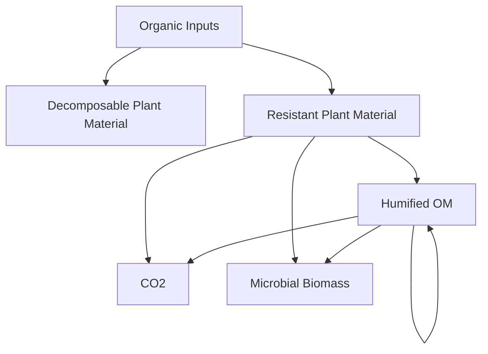
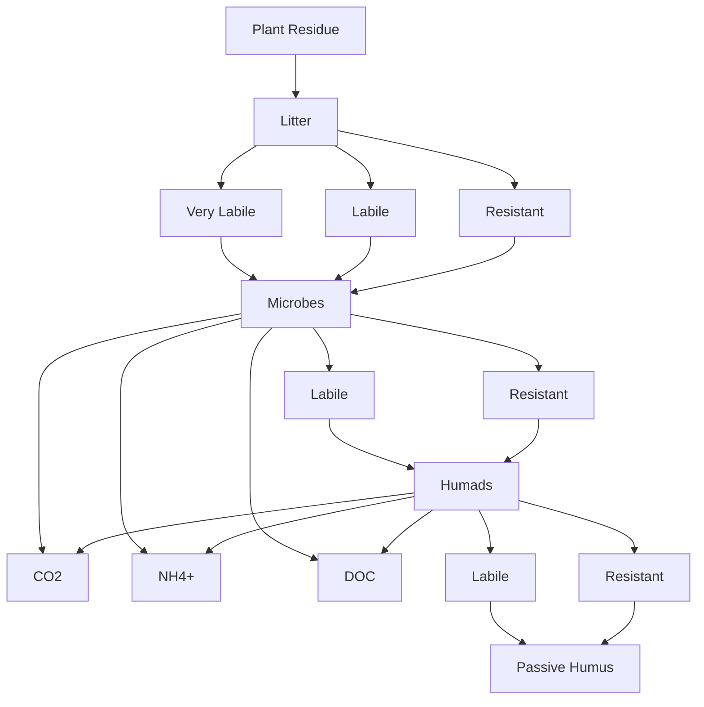
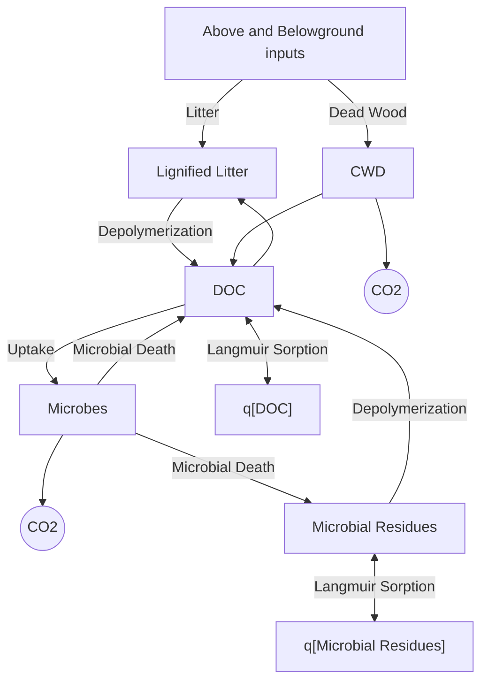
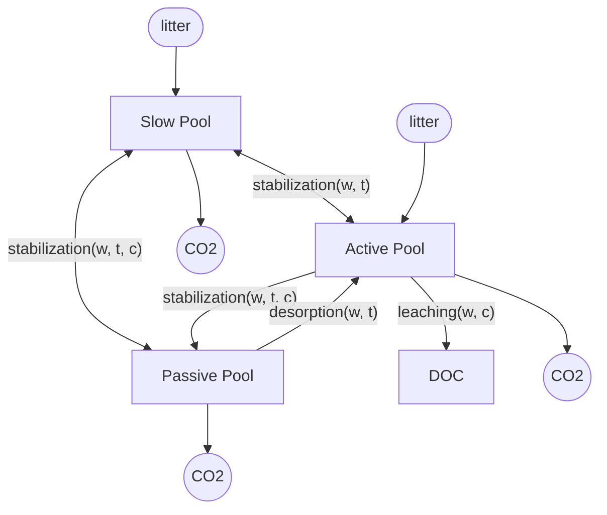
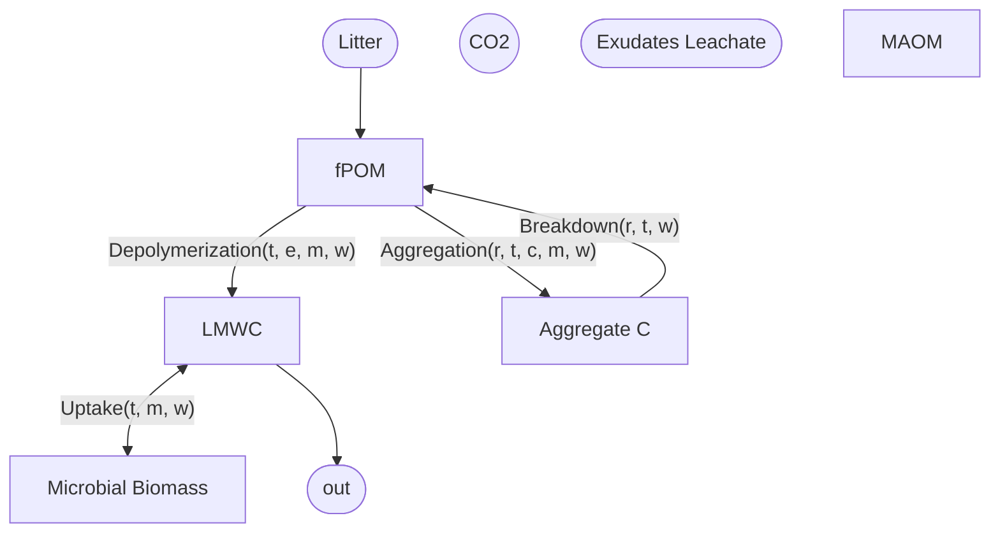

# Why is soil organic matter so complex?
1. Many different sources of SOM
2. Large and heterogeneous decomposer community
3. Multiple degradation pathways
4. Formation and persistence of SOM are affected by climatic and soil properties
5. ~={red}**Bulk SOM delivers only general information**=~
6. ~={red}**SOM has to be subdivided into pools (conceptual) or fractions (experimental) in order to study its properties**=~

# Methods to characterize soil organic matter

1. [[#Conceptual Models]]
2. [[#Computational Models]]
3. [[#Incubation Studies]]
4. [[#Chemical Fractionation]]
5. [[#Physical Fractionation]]
6. [[#Combined Physical-Chemical Fractionation]]

## Conceptual Models

- Conceptual models of SOM represent theoretical "pools" of carbon.
- For example, a simple set of pools would be
	- **Active C:** MRT of <10 years (Rapid Nutrient Supply)
	- **Slow C:** MRT of 10-100 years (Soil Structure and Productivity)
	- **Passive C:** MRT >100 years (Long term C storage)
## Computational Models
+ Current earth system models apply soil models that assume first-order kinetic exchanges amount conceptual pools that are defined by empirical turnover times
+ These models reflect the cutting edge of C cycle science in the 70s and 80s (Century and RothC).
+ Such models are still of great utility as they capture many essential dynamics, are mathematically simple, and run efficiently over large spatial and temporal scales.
+ Movement between C pools and their decomposition rates are modified by temperature, texture, and moisture.
+ These models (RothC, DNDC, Century) do not explicitly represent the characteristic processes of C transformation such as adsorption, protection, desorption, and microbial activity
+ Default turnover rates associated with individual carbon pools are justified by the combined influence of physical protection and an inferred resistance to decomposition that is dependent on substrate quality (molecular/chemical composition of the organic matter)
+ "slow" and "passive" pools, the inherent resistance to decomposition (recalcitrance) has been understood to be the result of "humification" with the RothC and DNDC models explicitly including 'humified' and 'passive humus' fractions.
+ Lack of mechanistic representation of the decomposition process produces disagreement among models and between model predictions and observable data.

### Rothamsted Carbon Model (RothC)

+ This was the first attempt at creating a computational model of global SOM.

### DeNitrification-DeComposition (DNDC) Pools

### COMISSION model

### Century Model

### Millennial Model

| Factor                      | Key |
| --------------------------- | --- |
| Clay %                      | c   |
| Exoenzymes                  | e   |
| water                       | w   |
| Microbial Functional Groups | m   |
| Roots                       | r   |
| Soil C Pool                 | s   |
| Temperature                 | t   |

Theres more but Im lazy

Measurability of factors influencing pools in Millennial model

| Soil C Pool | Widely Measured  | Measurable by Proxy             | Mechanisms that need proxies and/or other data to define rate constants |
| ----------- | ---------------- | ------------------------------- | ----------------------------------------------------------------------- |
| Aggregate C | Clay Content     | root exudation                  | bioturbation                                                            |
|             | Rainfall         | fungal production               | plowing                                                                 |
|             |                  | aggregate turnover              | compaction                                                              |
|             |                  | root growth                     | freeze-thaw                                                             |
|             |                  |                                 | effects of rainfall on aggregates                                       |
|             |                  |                                 | necromass production                                                    |
| MAOM        | pH               | OC on mineral surface           | tillage                                                                 |
|             |                  | minerology                      | oxidative enzymes                                                       |
|             |                  | phosphate/sulfate concentration | electrostatic interactions                                              |
|             |                  |                                 | ionic strength                                                          |
|             |                  |                                 | necromass production                                                    |
| POM         | NPP              | secondary production            | fragmentation of litter                                                 |
|             |                  | litter chemistry                |                                                                         |
|             |                  | decomposition of litter         |                                                                         |
| LMWC        | soil moisture    | DOC concentration               | sorption potential                                                      |
|             |                  | leaching rate                   |                                                                         |
| Microbes    | soil temperature | microbial biomass               | internal allocation                                                     |
|             |                  | microbial growth rate           | fate of necromass                                                       |
|             |                  | respiration                     | competition                                                             |
|             |                  | CUE                             |                                                                         |
|             |                  | enzyme activity                 |                                                                         |

### Millennial V2
+ A soil model developed to simulate C pools that can be measured by extraction or fractionation, including POM, MAOM, Aggregate C, Microbial Biomass, and LMWC
+ Model processes were update to reflect the current understanding of mineral-association, temperature sensitivity, and reaction kinetics
## Incubation Studies
+ **Soil samples are incubated in the laboratory:**
	+ Optimal moisture content
	+ Constant temperature
	+ t = weeks - years
+ **On a regular basis, $\ce{CO2}$ is measured**
	+ GC
	+ Infrared analyzer
	+ $\ce{NaOH}$-trap followed by titration with $\ce{HCl}$
+ **Often, net N mineralization is determined as well**

## Chemical Fractionation

## Physical Fractionation

### Aggregate Stability

### Density Fractionation

## Combined Physical-Chemical Fractionation
## Problems with SOM characterization

